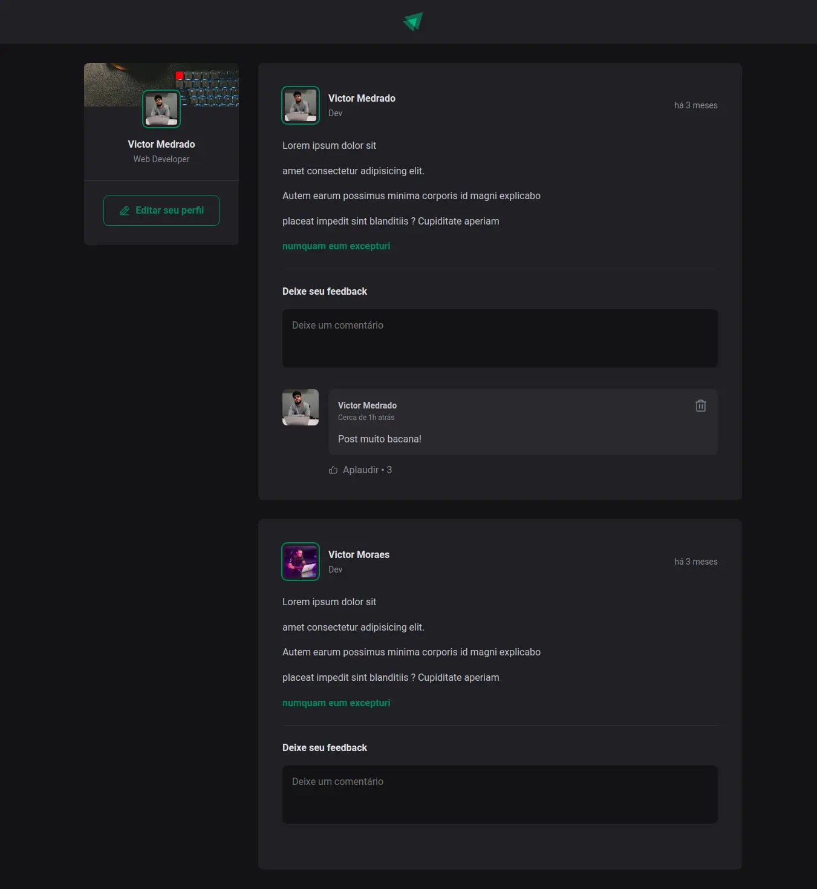
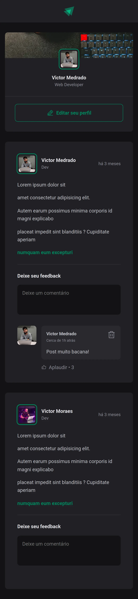

<h1 align="center">
    
</h1>

<p align="center" id="objetivo">Aplicação Post Feed, para praticar conceitos React + TypeScript.</p>

<h4 align="center" id="requisitos"> Pré-requisitos </h4>

<p align="center">Antes de começar, você vai precisar ter instalado em sua máquina as seguintes ferramentas:
[Git](https://git-scm.com), [Node.js](https://nodejs.org/en/). </p>

<p align="center">
Além disto é bom ter um editor para trabalhar com o código como [VSCode](https://code.visualstudio.com/)
</p>

### :camera_flash: Layout

<div align="center" style="display: flex; align-items: flex-start; justify-content: center;">

  

  
</div>

### 🛠 Tecnologias e recursos

As seguintes ferramentas foram usadas na construção do projeto:

- [Node.js](https://nodejs.org/en/)
- [React](https://pt-br.reactjs.org/)
- [TypeScript](https://www.typescriptlang.org/)
- [CSS Modules](https://github.com/css-modules/css-modules)
- [Axios](https://axios-http.com/ptbr/)

Possui os seguintes recursos:

- Adicionar um comentário
- Remover um comentário
- Curtir um comentário

100% Responsivo!

### 🎲 Rodando o projeto

```bash
# Clone este repositório
$ git clone <https://github.com/victormmoraes/simple-post-feed-react-practice.git>

# Acesse a pasta do projeto no terminal/cmd
$ cd simple-post-feed-react-practice

# Instale as dependências
$ npm install

# Execute a aplicação em modo de desenvolvimento
$ npm run dev

# O servidor iniciará e um link local será disponibilizado
```

### 🦸 Autor

Feito com ❤️ por Victor Medrado 👋🏽 [Entre em contato!](https://www.linkedin.com/in/victormedrado/)

